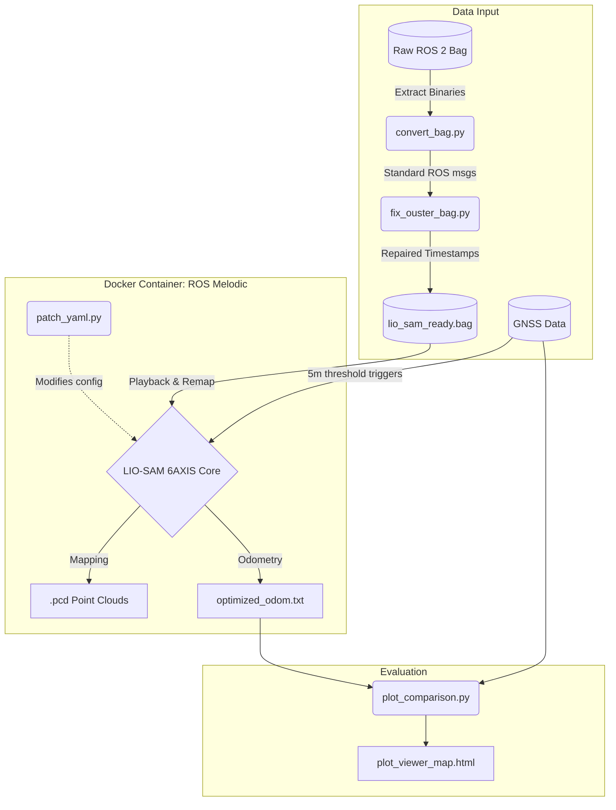

# Final Report: Application of LIO-SAM 6AXIS for LiDAR-based Positioning

<video
src="https://github.com/user-attachments/assets/8927424c-57e8-4176-9076-d3b6719260ea"
loop autoplay muted controls></video>

> **Project Goal:** To construct a highly accurate 6-DoF trajectory and 3D point cloud map utilizing raw data from an Ouster OS0-32 LiDAR, an internal IMU, and RTK-GNSS positioning from a PX4 Autopilot.

---

## 1. Code Architecture

### 1.1 Branch Structure
The repository is organized into the following key directories to maintain a clean separation of concerns:

```text
.
├── bag_preparation/      <- Scripts to convert and synchronize raw ROS 2 bags
├── bags/                 <- Data storage for pre-processed, SLAM-ready rosbags
├── config/               <- Core configuration files for the LIO-SAM 6AXIS algorithm
├── data/                 <- Storage for Ground Truth JSON/CSV files
├── output/               <- Destination for 3D .pcd maps and optimized trajectory logs
├── scripts/              <- Evaluation and visualization scripts (e.g., Plotly comparisons)
└── src/                  <- Patched C++ source files for LIO-SAM 6AXIS
```

### 1.2 Data Pre-Processing
The core data for this module is provided as **Test 1**, recorded by an XTrack vehicle platform. Crucially, the raw data is provided as a **ROS 2 Bagfile**, while LIO-SAM 6AXIS requires **ROS 1 Melodic** to function. Furthermore, the raw sensor messages are published in hardware-specific ROS 2 message types that standard SLAM nodes cannot interpret directly.

**Topic Requirements & Conversion:**
The system specifically targets three raw data streams:

| Sensor Source | Original ROS 2 Topic | Original Message Type | Required LIO-SAM Topic | Required Message Type |
| :--- | :--- | :--- | :--- | :--- |
| **LiDAR** | `/ouster/points` | `sensor_msgs/PointCloud2` | `/os_cloud_node/points` | `sensor_msgs/PointCloud2` |
| **IMU** | `/ouster/imu_meas` | Ouster-specific Message | `/stim300/imu/data_raw` | `sensor_msgs/Imu` |
| **GNSS/GPS** | `/fmu/out/vehicle_gps_position` | `px4_msgs/SensorGps` | `/gps/fix` | `sensor_msgs/NavSatFix` |

To bridge the gap between the raw ROS 2 inputs and the ROS 1 LIO-SAM requirements, the `bag_preparation` directory contains two vital scripts:
1.  **`convert_bag.py`**: Reads the ROS 2 bag and converts the hardware-specific message types of the Ouster IMU and PX4 Autopilot GPS into standard `sensor_msgs/Imu` and `sensor_msgs/NavSatFix` messages.
2.  **`fix_ouster_bag.py`**: Ouster sensors without PTP time synchronization suffer from highly asynchronous timestamps between the LiDAR and IMU. This script smooths and aligns these timestamps within the bag file; without this, the LIO-SAM factor graph crashes immediately upon initialization.

### 1.3 Containerized Pipeline
After pre-processing, the system is deployed using a containerized **ROS Melodic** environment. This isolates the legacy ROS 1 dependencies from the modern host machine. The complete pipeline is illustrated in the diagram below:



**Pipeline Components:**
*   **Containerization (`docker-compose.yml`)**: Spawns an isolated `lio_sam_6axis` environment.
*   **Dynamic Configuration (`patch_yaml.py`)**: Automatically injects dynamic hardware variables and noise tolerances directly into the LIO-SAM parameter files before execution.
*   **Execution Scripts (`run_lio_sam.sh` & `run_lio_sam_gnss.sh`)**: Orchestrates the time-synchronized playback, remaps the topics from the ROS 2 bag to the ROS 1 node names (as shown in the table above), and triggers auto-saving of the map upon completion.

---

## 2. Choice of Algorithms & System Design

### 2.1 Algorithm Selection
**LIO-SAM 6AXIS** (LiDAR Inertial Odometry via Smoothing and Mapping) was selected for its tightly-coupled LiDAR-IMU architecture built upon a factor graph (GTSAM). Unlike loosely-coupled methods, LIO-SAM pre-integrates IMU measurements between LiDAR scans to de-skew the point cloud and provide a robust initial guess for LiDAR odometry. This makes it highly resilient to rapid motions and feature-poor environments.

### 2.2 System Simplifications & Assumptions
To make the algorithm function with the unique properties of the Sensys dataset, several core assumptions and parameter modifications were required:

*   **Extrinsic Rotation & RPY (Assumed Identity)**: The extrinsic calibration matrix between the LiDAR and the IMU was forced to the identity matrix (`[1,0,0, 0,1,0, 0,0,1]`). We assumed the internal IMU is mechanically aligned perfectly with the optical center of the Ouster sensor.
*   **Gravity Vector (`imuGravity`)**: ROS standard REP-145 dictates gravity is recorded as an upward reaction force ($+9.81$). The Ouster sensor records it downwards. We applied a hardcoded modification to `-9.80511` to prevent immediate mathematical divergence.
*   **IMU Noise/Bias Tolerances (`imuAccNoise`, `imuGyrNoise`)**: The internal Ouster IMU is known to be relatively low-grade compared to external, dedicated tactical-grade IMUs. *Simplification:* We heavily increased the `imuAccNoise` and `imuGyrNoise` parameters in the configuration. By doing so, the factor graph optimization "trusts" the IMU less over long durations, relying more heavily on the LiDAR point-to-plane ICP registrations, preventing long-term drift accumulation.

### 2.3 Advanced GNSS Integration Patches
Integrating the absolute RTK-GNSS positioning from the PX4 Autopilot into LIO-SAM presented significant engineering hurdles. 

When the vehicle starts, it is stationary for an extended period. The raw GNSS signal drifts heavily during this stationary phase (creating a "spaghetti node" of false movements). If LIO-SAM initializes its global reference frame (Yaw) based on this noisy stationary data, the entire map will be rotated incorrectly.

**C++ Design Fix:** 
We injected custom patches into the core LIO-SAM architecture (`simpleGpsOdom_patched.cpp` and `mapOptmizationGps.cpp`). 
*   **5-Meter Threshold:** The odometry node now fundamentally ignores all GNSS data until the LiDAR-based odometry confirms the vehicle has traveled more than 5 meters linearly.
*   **Retroactive Optimization:** Once the 5-meter threshold is crossed, a stable trajectory vector is computed, a reliable Yaw angle is established, and the GNSS data is injected into the GTSAM factor graph to retroactively optimize and align the map.

---

## 3. Results & Evaluation

The final evaluation was conducted using custom Python scripts (`plot_comparison.py`) running entirely outside of ROS, relying on standard libraries to compare the drifting trajectories against the high-accuracy Ground Truth.

### 3.1 Evaluation Pipeline
1. `extract_origin.py` reads the initial reference angle (Yaw) and the starting LLA coordinates.
2. `plot_comparison.py` maps the local Cartesian LiDAR frames back to WGS84 global coordinates.
3. Results are rendered into an interactive web viewer (`plot_viewer_map.html`).

### 3.2 Findings
*   **Raw GNSS (No LIO-SAM):** Exhibited severe multi-path errors and stationary drift.
*   **LIO-SAM (LiDAR + IMU only):** Provided extremely smooth local trajectories and sharp point cloud maps. However, over the 14-minute runtime, slight rotational drift accumulated, leading to deviations from the absolute global path.
*   **GNSS-Optimized LIO-SAM:** By applying our custom 5-meter movement threshold patches, the factor graph successfully pulled the drifting LiDAR map back to the absolute RTK ground truth, correcting both translational and rotational drift seamlessly.

### 3.3 Engineering Challenges Conquered
1.  **Asynchronous Timestamps:** The biggest initial challenge was the total failure of LIO-SAM due to asynchronous LiDAR and IMU message timestamps. Developing `fix_ouster_bag.py` to rewrite the temporal headers of the `.db3` bag was crucial for the factor graph to even initialize.
2.  **Stationary GPS Noise:** As detailed above, modifying the C++ source code to delay GPS initialization was critical. Without this, maps were consistently generated with a 15-40 degree rotational error relative to True North.
