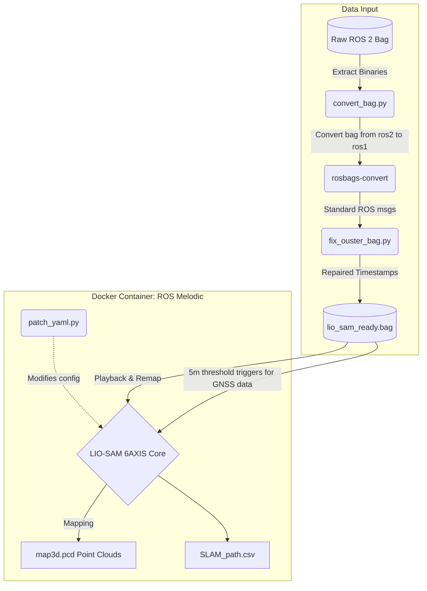

# Final Report: LIO-SAM 6AXIS
> **Project Goal:** Applying SLAM (LIO-SAM-6AXIS: https://github.com/JokerJohn/LIO_SAM_6AXIS) to the provided Test 1 dataset resulted in a 2D trajectory, a 3D point cloud, and an error plot. Furthermore, comparing the use of LIDAR points + IMU with LIDAR points + IMU + GNSS data.
> 
<video
src="https://github.com/user-attachments/assets/8927424c-57e8-4176-9076-d3b6719260ea"
loop autoplay muted controls></video>

---

## 1. Code Architecture

### 1.1 Branch Structure
This Branch is organized into the following key directories to maintain a clean separation of concerns:

```text
.
├── bag_preparation/      <- Scripts to convert and synchronize raw ROS 2 bags
├── scripts/              <- Execution and configuration scripts for LIO-SAM
└── src/                  <- Patched C++ source files for LIO-SAM 6AXIS
```

### 1.2 Data Pre-Processing
The core data for this module is provided as **Test 1**, recorded by an XTrack vehicle. The raw data is provided as a **ROS 2 Bagfile**, while LIO-SAM 6AXIS requires **ROS 1 Melodic** to function. Furthermore, the raw sensor messages are published in hardware-specific ROS 2 message types that standard SLAM nodes cannot interpret directly.

**Topic Requirements & Conversion:**
The system specifically targets three raw data streams from the rosbag:

| Sensor Source | Original ROS 2 Topic | Original Message Type | Required LIO-SAM Topic | Required Message Type |
| :--- | :--- | :--- | :--- | :--- |
| **LiDAR** | `/ouster/points` | `sensor_msgs/PointCloud2` | `/os_cloud_node/points` | `sensor_msgs/PointCloud2` |
| **IMU** | `/ouster/imu_meas` | `aspn_msgs/MeasurementIMU` | `/stim300/imu/data_raw` | `sensor_msgs/Imu` |
| **GNSS/GPS** | `/fmu/out/vehicle_gps_position` | `px4_msgs/SensorGps` | `/gps/fix` | `sensor_msgs/NavSatFix` |

To bridge the gaps between the raw ROS 2 inputs and the ROS 1 LIO-SAM requirements, the `bag_preparation` directory contains two vital scripts:
1.  **`convert_bag.py`**: Reads the ROS 2 bag and converts the hardware-specific message types of the Ouster IMU and PX4 Autopilot GPS into standard `sensor_msgs/Imu` and `sensor_msgs/NavSatFix` messages.
2.  **`fix_ouster_bag.py`**: The provided data from the Ouster sensors suffer from asynchronous timestamps between the LiDAR and IMU. This script smooths and aligns these timestamps within the bag file; without this, LIO-SAM crashes immediately upon initialization.

### 1.3 Containerized Pipeline
After pre-processing, the system is deployed using a containerized **ROS Melodic** environment. This isolates the ROS 1 dependencies from the host machine. The complete pipeline is illustrated in the diagram below:



**Pipeline Components:**
*   **`docker-compose.yml`**: Creates an isolated `lio_sam_6axis` environment.
*   **`patch_yaml.py`**: Insertes variables and noise tolerances directly into the LIO-SAM parameter files before execution.
*   **`run_lio_sam.sh` & `run_lio_sam_gnss.sh`**: Orchestrates the time-synchronized playback, remaps the topics from the ROS 2 bag to the ROS 1 node names (as shown in the table above), and triggers auto-saving of the results after completion.
*   **`format_slam_output.py`**: A post-processing script called automatically by the launch scripts. It reads the raw LIO-SAM outputs, converts the local trajectory into global Latitude/Longitude, computes NED velocities, and creates a clean `SLAM_path.csv` alongside the renamed `map3d.pcd` point cloud.

### 1.4 Run guide
Follow these steps to run the SLAM pipeline on your machine:

1. **Check requirements**:
    ```bash
   pip install -r requirements.txt
   ```
2. **Prepare the Data**: Start by placing your raw ROS 2 bag folder/files into the `bags/` directory. Then, run the pre-processing scripts from the `bag_preparation/` folder to convert the ROS 2 messages to ROS 1 and synchronize the Ouster timestamps.
   ```text
   .
   ├── bags/
   │   └── <your_raw_ros2_bag>   <- Place your raw ROS 2 data here
   ```
   Execute the conversion and synchronization:
   ```bash
   python3 bag_preparation/convert_bag.py
   rosbags-convert --src bags/rosbag_new --dst bags/rosbag_new.bag
   python3 bag_preparation/fix_ouster_bag.py
   ```
   This will output a final, synchronized ROS 1 bag named `lio_sam_ready.bag` inside your `bags/` directory.
3. **Start Docker locally**: Start up docker desktop.
4. **Start Xlaunch**: For a live feed of the map creation, you have to start a program enabaling Docker to show Rviz on the host machine. (Ideally XLaunch)
5. **Start the SLAM Node**: Start the container using Docker Compose. By default, it runs without GNSS data:
   ```bash
   docker-compose up
   ```
   If you want to enable GNSS fusion (make sure you converted the bags with the GNSS scripts first!), run it with the `USE_GNSS` environment variable set:
   ```bash
   USE_GNSS=true docker-compose up
   ```
5.1 **Wait for Completion**: Docker Compose will launch the container, configure LIO-SAM dynamically, play the bag file, and process the data. 
5.2 **Output Generation**: Once finished, the pipeline automatically processes the results and saves them in the `output/maps/` directory. You will find exactly two files for each run:
   - `map3d.pcd`: The generated 3D point cloud map.
   - `SLAM_path.csv`: The converted 2D trajectory (Lat/Lon) and velocity data.

---

## 2. Choice of Algorithms & System Design
**LIO-SAM 6AXIS** (LiDAR Inertial Odometry via Smoothing and Mapping) was selected for its tightly-coupled LiDAR-IMU architecture built upon a factor graph (GTSAM). Unlike uncoupled methods, LIO-SAM pre-integrates IMU measurements between LiDAR scans to de-skew the point cloud and provide a robust initial guess for LiDAR odometry. This makes it highly resilient to rapid motions and feature-poor environments.

### 2.1 About LIO-SAM 6AXIS
LIO-SAM 6AXIS is a specialized adaptation of the original LIO-SAM (LiDAR Inertial Odometry via Smoothing and Mapping) framework, designed specifically to operate with 6-axis IMUs (which measure 3-axis acceleration and 3-axis angular velocity but lack a magnetometer for absolute heading). The system functions by constructing a non-linear factor graph to tightly couple LiDAR odometry and IMU pre-integration. The IMU data is first used to de-skew the continuous LiDAR sweeps and provide a high-frequency, initial motion estimate. This estimate is then refined by matching extracted LiDAR point cloud features (such as edges and planar surfaces) against a maintained global map. Because it relies only on 6-axis data, it is highly flexible and perfectly suited for sensors like the Ouster LiDAR, which feature internal 6-axis IMUs rather than 9-axis variants.

### 2.2 System Simplifications & Assumptions
To make the algorithm function with the properties of the provided dataset, some assumptions and parameter modifications were required:

*   **Extrinsic Rotation & RPY (Assumed Identity)**: The extrinsic calibration matrix between the LiDAR and the IMU was set to the identity matrix (`[1,0,0, 0,1,0, 0,0,1]`). There is no transformation between the LiDAR and the IMU, since the Ouster IMU was used for this project.
*   **Gravity Vector (`imuGravity`)**: ROS standard REP-145 dictates gravity is recorded as an upward reaction force (+9.81). The Ouster sensor records it downwards. A hardcoded modification of `-9.80511` was applied to prevent mathematical divergence.
*   **IMU Noise/Bias Tolerances (`imuAccNoise`, `imuGyrNoise`)**: The internal Ouster IMU is known to be relatively low-grade compared to external, dedicated IMUs. *Adaptation:* The `imuAccNoise` and `imuGyrNoise` parameters were increased in the configuration. By doing so, the factor graph optimization "trusts" the IMU less over long durations, relying more on the LiDAR point-to-plane ICP registrations, reducing long-term drift accumulation.

### 2.3 Challanges
Some changes to the code of LIO-SAM-6AXIS were neccessary to make it run:

1. **Automated Docker Patches (`patch.py` at runtime/buildtime):**
   *   **Eigen Alignment Fix:** Automatically added the macro `EIGEN_MAKE_ALIGNED_OPERATOR_NEW` to all core classes (such as `ParamServer` and `mapOptimization`) to prevent memory segmentation faults during memory allocation on modern processors (AVX/AVX2).
   *   **Ouster Timestamp Struct:** Modified the `OusterPointXYZIRT` struct so that the timestamp `t` exactly matches the scaling of the bags (`dst.time = src.t * 1e-9f;`); otherwise, the point cloud registration crashes.

**GNSS Integration**
Integrating the GNSS positioning from the PX4 Autopilot into LIO-SAM presented some challenges. 

When the vehicle starts, it is stationary for a significant period. The raw GNSS signal drifts heavily during this stationary phase. If LIO-SAM initializes its global reference frame (Yaw) based on this noisy stationary data, the entire map would be rotated incorrectly.

1. **`simpleGpsOdom_patched.cpp` (GNSS Odometry Injection):**
   *   **5-Meter Initialization Threshold:** Implemented a distance check (`if (distance > 5.0)`). The system ignores all GNSS data and only initializes the global orientation (Yaw) once the vehicle has physically moved 5 meters away from the starting point. This prevents "spaghetti drifting" while stationary.
   *   **Coordinate System Rotation:** The ENU (East-North-Up) coordinates are explicitly rotated to align with the initial angle (Yaw) of the local LiDAR odometry (`calib_enu(0) = rx; calib_enu(1) = ry;`).
   *   **Covariance Injection:** The actual measurement uncertainties (`covariance`) from the ROS 2 bag (`msg->position_covariance`) are forwarded directly into the `nav_msgs::Odometry` message for the factor graph, instead of using error-prone default values.

2. **`mapOptmizationGps.cpp` (Factor Graph Integration):**
   *   **GTSAM Node Injection:** This file (which is actively mounted at runtime) contains the extended backend logic required to feed the pre-processed GNSS odometry into the non-linear factor graph (GTSAM). Here, the absolute GNSS coordinates are integrated as anchored "prior factors" into the global trajectory optimization. Without this adapted logic, LIO-SAM would simply ignore the GPS pings.

---

## 3. Results & Evaluation

The final evaluation was conducted using custom Python scripts running outside of ROS, relying on standard libraries to compare the drifting trajectories against the Ground Truth GNSS data. *(Note: The raw data and outputs have been omitted from this slimmed-down repository delivery. All plots scripts are contained a folder).*

### Produced point clouds for Test 1  


### 3.1 Evaluation Pipeline


### 3.2 Findings


**Impact of GNSS Data on Mapping Accuracy**

Comparing the generated point clouds (as seen in the visualization above) reveals a significant difference in map consistency when GNSS data is omitted, particularly during high-dynamic maneuvers:

1. **Trajectory Deviation and "Curving":** The point cloud generated purely from LiDAR and IMU (without GNSS data) exhibits a sharp, incorrect bend in the trajectory that does not exist in reality (as verified by the GNSS-assisted map).
2. **Failure during Fast Rotation (Perceptual Aliasing):** LIO-SAM relies on feature-based scan matching (a variant of the Iterative Closest Point or ICP algorithm). It extracts and matches geometric features like edges and planar surfaces between consecutive LiDAR scans to estimate odometry. During the rapid rotation around the robot's vertical axis, the spatial overlap between consecutive scans is drastically reduced. In this scenario, the algorithm likely encountered similar-looking edges in the environment (perceptual aliasing) and incorrectly associated them. This wrong data association forces a completely incorrect heading estimation, causing the mapped trajectory to diverge and "curve" away.
3. **IMU Pre-integration Limits:** During rapid rotations, it seems that low-cost IMUs accumulate significant noise and their pre-integration drifts. LIO-SAM relies heavily on the IMU to de-skew the LiDAR sweeps and to provide an initial guess for the scan-matching algorithm. If the IMU provides a faulty initial rotation guess due to high error tolerance limits or noise, the ICP algorithm will converge into a wrong local minimum, matching the wrong geometric features.
4. **Motion Skew/Blur:** A LiDAR takes time to complete a 360-degree sweep (typically 100ms). Fast rotation during this sweep distorts the point cloud (motion skew). If the IMU data is noisy, the de-skewing process fails, causing the scan to warp. Warped point clouds cannot be matched accurately against the existing map, compounding the registration error.
5. **GNSS as a Global Constraint:** The GNSS data provides an absolute global reference that corrects these local heading and translation errors. Without it, the system has no way to correct a false heading induced by a bad scan match during a rapid rotation, resulting in permanent map distortion.
