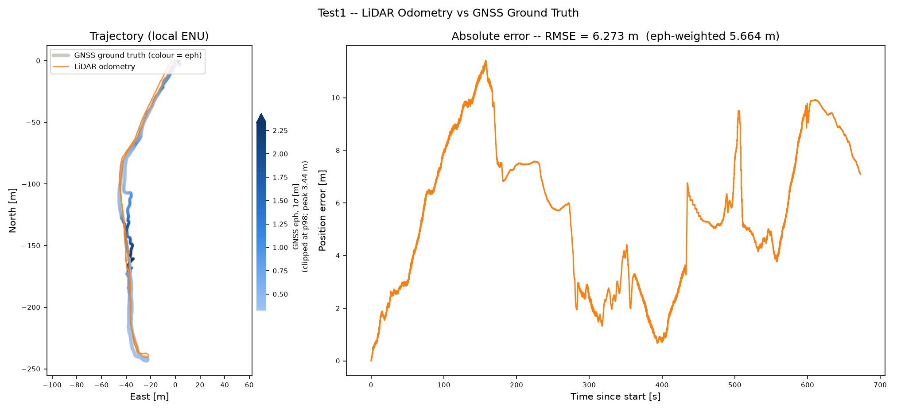
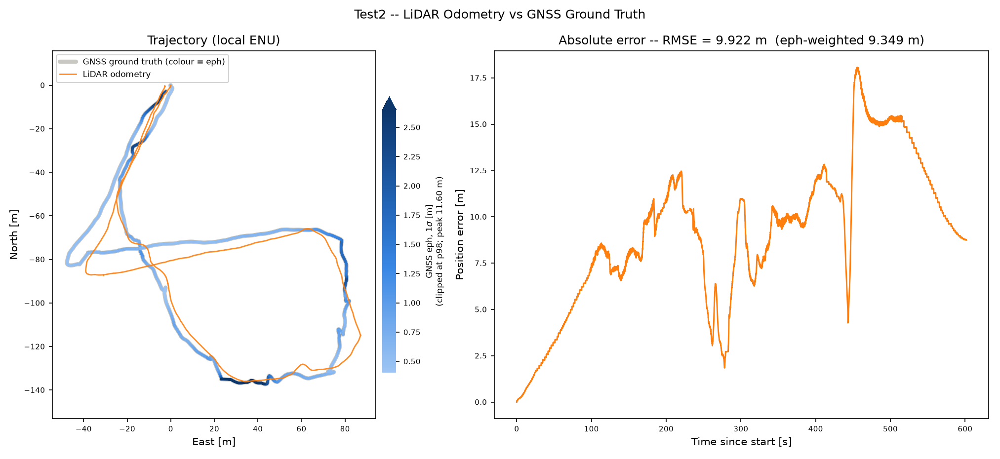
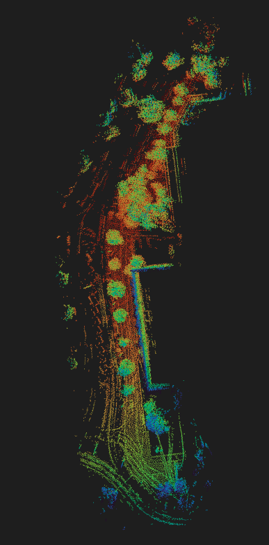
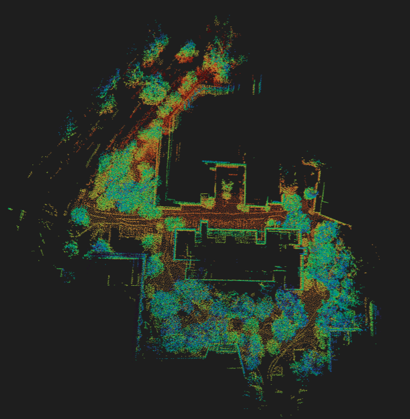
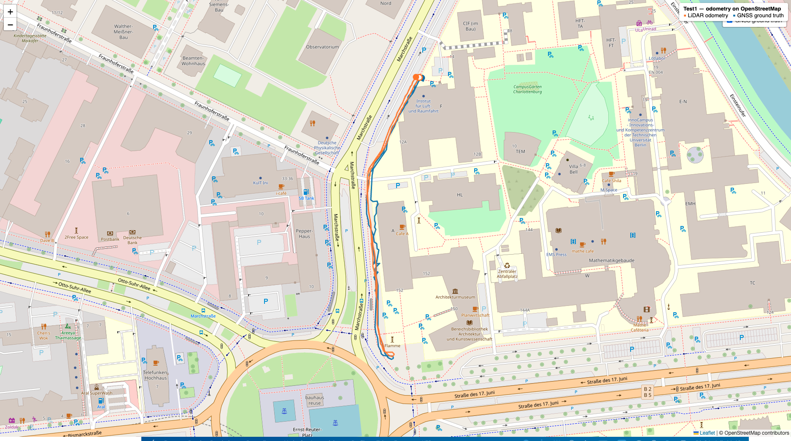
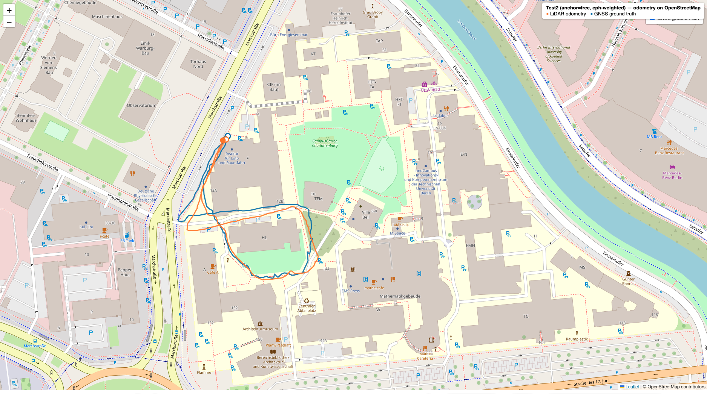
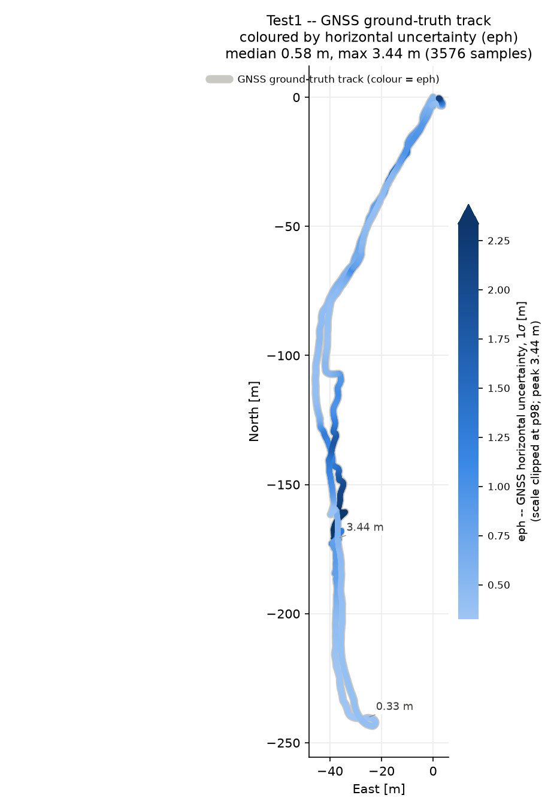
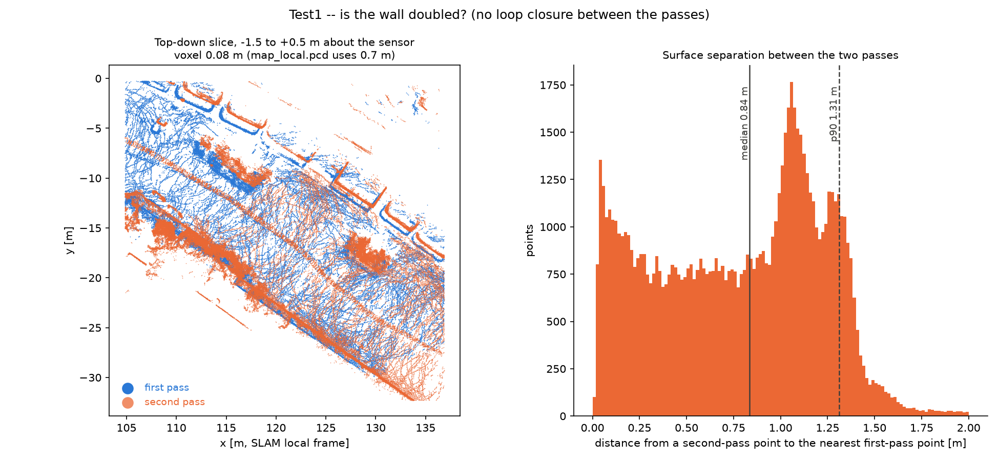

# Sensys LiDAR Positioning Pipeline

LiDAR odometry/SLAM on the XTrack dataset (Ouster OS0 + PX4), evaluated against
the filtered GNSS ground truth. See `DESCRIPTION.md` for the task brief.

Run everything from the repository root so the relative paths in `/configs/config_test1.yaml`
resolve. All input/output paths and the run window are configured in
[`/configs/config_test1.yaml`](/configs/config_test1.yaml) (Test1). Test2 is a separate recording with its own
[`/configs/config_test2.yaml`](/configs/config_test2.yaml) — pass it with `--config` (see *Results →
Test2*).

## Preprocessing

### Extract the ground truth for the run

The provided ground truth, `xtrack_global_position_t12.csv`, is PX4's filtered
`vehicle_global_position` (the recommended GNSS reference) and covers **both**
datasets back-to-back. It must be cropped to a single run's time window before
use. This step writes a per-run CSV cropped on `timestamp_sample` (the key
shared with the rosbag), preserving all columns. It reads the run window
straight from `/configs/config_test1.yaml`, so switching to Test2 is just a config edit.

```bash
python scripts/extract_ground_truth.py            # uses /configs/config_test1.yaml
# options: --config <path>  --output <path>
```

Output (Test1): `data/xtrack_gnss_corrected/xtrack_global_position_t12_test1.csv`
— 4112 rows over 822 s (~5 Hz), all `lat_lon_valid`/`alt_valid`.

## Running the pipeline

From the repository root, with the virtualenv active:

```bash
python run_pipeline.py --config /configs/config_test1.yaml              # all stages in order
python run_pipeline.py --config /configs/config_test1.yaml --stage odometry   # a single stage
```

Valid stages: `timestamps`, `odometry`, `align`, `velocity`, `evaluate`, `map`,
`map3d`, `colormaps`. They are sequential — each stage reads the previous stage's
output from `paths.output_dir`, so a stage can be re-run alone as long as its
inputs already exist (`--stage X` runs `X` and every stage after it). With
`lidar.source: bag` the `timestamps` stage is optional (it only builds the `.laz`
manifest needed by `lidar.source: laz`).

Process a **range of scans** with `--frames START END` (closed range, `END`
inclusive), e.g. `--frames 1000 2000`. This overrides `run.frame_start` /
`run.frame_end` in the config; the legacy `run.max_frames` (first-N-scans cap) is
still honoured when `frame_end` is null. Test1 has **8,194** scans (Test2:
6,008); bounds are clamped to what exists. A full run is ~5–7 min in pure Python.

## Pipeline stages

```
bag / .laz ─▶ timestamps ─▶ odometry ─▶ align ─▶ velocity ─▶ evaluate ─▶ map ─▶ map3d ─▶ colormaps
                            (KISS-ICP)   (georef)  (NED)      (RMSE)     (OSM)  (3D)    (coloured maps)
```

1. **timestamps** — pair each `.laz` scan with its bag-recorded timestamp
   → `scan_manifest.csv` (only needed for `lidar.source: laz`).
2. **odometry** — run the KISS-ICP package over the scans, seeded at
   the first GNSS ground-truth point → `poses_local.csv`, `map_local.pcd`.
3. **align** — anchored SE(3) georeference of the trajectory to GNSS ENU (start
   pinned to the ground truth, rotation-only fit; matching set by
   `alignment.time_match`; see *Alignment* below),
   re-expressed as lat/lon → `trajectory_latlon.csv`, `alignment_origin.yaml`.
4. **velocity** — smoothed finite-difference of the trajectory → `velocity_ned.csv`.
5. **evaluate** — re-match to GNSS, compute RMSE/mean/max error, plot trajectory +
   error-over-time → `error_evaluation.png`, `error_metrics.csv`.
6. **map** — render odometry + GNSS on an OpenStreetMap basemap → `trajectory_map.html`.
7. **map3d** — render the accumulated 3D point cloud interactively → `map_3d.html`.
8. **colormaps** — colour the 3D map by elevation (`map_local_height.pcd`, an
   instant post-process of `map_local.pcd`) and by the LiDAR's per-point return
   (`map_local_intensity.pcd`, which re-reads the bag) → both `.pcd` files.

All outputs land in `paths.output_dir` (default `outputs/test1/`).

## Module reference (`sensys_slam/`)

| Module | Responsibility |
| --- | --- |
| `timestamps.py` | `build_scan_manifest` — pair `.laz` files with bag-recorded `/ouster/points` timestamps. |
| `lidar_io.py` | Scan loaders: `BagScanDataset` (streams `/ouster/points` with per-point sweep time for deskew), `LazScanDataset` (`.laz`). Includes a self-contained numpy `PointCloud2` parser (no `kiss-icp` dependency). Both yield `(timestamp, points, point_times)`. |
| `odometry.py` | Drives the **KISS-ICP package** (PRBonn `kiss-icp`). `build_kiss_config` maps the `kiss_icp` config block → `kiss_icp.config.KISSConfig`; `run_odometry` seeds the engine at the first GT pose, registers each frame scan-to-map, and writes `poses_local.csv` + `map_local.pcd` (accumulating the registered downsamples into a global map, since the package's own local map is pruned to `max_range`). |
| `groundtruth.py` | Load `xtrack_global_position_t12.csv`, crop to the run window on `timestamp_sample`, drop invalid rows. |
| `geo.py` | WGS84 ↔ local ENU conversions (via `pymap3d`). |
| `frames.py` | Body-frame definition. `build_lidar_to_body` returns the LiDAR→Pixhawk-FRD rotation used to express scans in the body frame (`lidar.body_frame`). |
| `align.py` | `align_and_georeference` — anchored georeference: pin the start to the first GT row and fit only the rotation about it (`rotation_about_anchor`, eph-weighted SVD without the centroid step). Plus pose↔GT matching (`match_poses_to_gt`, `alignment.time_match`): `nearest_time_match` (absolute clock), `remap_times_proportional` and `_cumulative_fraction` (endpoint-corresponding time / arc-length fractions). `match_weights` = 1/eph² weights. |
| `velocity.py` | `compute_ned_velocity` — Savitzky-Golay-smoothed finite differences of ENU position → NED velocity. |
| `evaluate.py` | `evaluate_against_ground_truth` — RMSE/mean/max vs GNSS, trajectory + error plot. |
| `attitude.py` | **Optional** (`lidar.imu_deskew`). `AttitudeDeskewer`/`load_attitude_deskewer` — reads `/fmu/out/vehicle_attitude`, SLERP-interpolates, and rotation-deskews each sweep to the orientation at the sweep end. Replaces only the *rotational* part of KISS-ICP's constant-velocity deskew; off by default. |

## Alignment: georeferencing the trajectory to GNSS

KISS-ICP produces poses in a *local* world frame — metric, but with an arbitrary
initial heading and origin. The `align` stage (`sensys_slam/align.py`,
`align_and_georeference`) ties that track to the GNSS ENU frame with an
**anchored** fit: the start is pinned to the ground truth and only the rotation
about it is fit. The one knob is **how poses are matched to GT**
(`alignment.time_match`).

### Common setup

1. **GNSS → ENU.** Ground-truth lat/lon/alt is converted to local ENU metres
   (`geo.py`) about a tangent origin `ref_origin` — the run's first GT sample, the
   same point the odometry is seeded at, so the local frame starts at ENU ≈
   (0, 0, 0). The origin is stored in `alignment_origin.yaml`.
2. **Inverse-variance weights.** Each matched pair is weighted by
   `1 / max(eph, eph_floor)²` from PX4's own horizontal uncertainty `eph`
   (`alignment.eph_weighting`, `eph_floor_m = 0.3`), so the several-metre GNSS
   wander during EKF initialisation can't dominate the fit.
3. **Apply & re-project.** The fitted `R, t` are applied to the *entire*
   trajectory, converted back to lat/lon (`enu_to_geodetic`) →
   `trajectory_latlon.csv`.

### Matching modes (`alignment.time_match`)

The pose↔GT pairing (`match_poses_to_gt`) feeds both the fit and the evaluation:

- **`absolute`** (default) — nearest **shared-clock** timestamp within
  `max_time_diff_s` (0.15 s). Correct when the LiDAR and GNSS share an epoch.
- **`proportional`** — the two clocks **don't** share an epoch, but the runs
  correspond end-to-end (first scan ↔ first GT row, last ↔ last). Scan times are
  linearly remapped onto the GT span by **run fraction**, then nearest-matched.
- **`arclength`** — also endpoint-corresponding, but match by **fraction of
  distance travelled**, not time. Use this when the dwell/speed profiles differ:
  e.g. the Test2 LiDAR sits stationary at the start for ~32 % of its scans while
  the GT window doesn't, so a *time* fraction pairs a parked scan with GT that has
  already moved off — a *path* fraction does not (a stationary stretch is ~0 arc
  length on both sides). On Test2 this alone cut the RMSE 38 m → ~10 m.

### The anchored fit

The trajectory start is pinned to the **first GT row** — the same point the
odometry ENU frame is seeded at, so the two tracks begin at exactly the same
place — and **only the rotation** about that anchor is fit
(`rotation_about_anchor`: the usual Umeyama/Kabsch SVD with a determinant-sign
guard against reflections, but *without* removing the centroid, applied to
start-relative vectors). There is no free translation, so drift away from the
anchor is exposed rather than partly absorbed by re-centring.

The reported fit RMSE is the eph-weighted residual over the matched pairs.

## Coordinate frames

Per `DESCRIPTION.md`, the **Pixhawk coordinate system is taken as the body
frame**: FRD — X forward, Y right, Z down. Expressing every sensor in this one
frame is what lets the LiDAR clouds and the PX4 attitude (`vehicle_attitude`,
which is body→NED) be combined consistently.

`sensys_slam/frames.py` builds the LiDAR→body rotation. The Ouster sensor frame
is FLU (X-fwd, Y-left, Z-up); assuming the Ouster is mounted axis-aligned with
the Pixhawk, the default LiDAR→body rotation is the FLU→FRD flip (180° about X).
Enable with `lidar.body_frame: true`; override the rotation with
`lidar.extrinsic_rpy_deg` (intrinsic XYZ degrees) if the true mounting is known.
Only rotation is modelled; the lever-arm translation is unknown and assumed zero.

> **Empirical caveat (this bag).** For *pure* LiDAR odometry the body-frame
> rotation is a constant and is absorbed by the global least-squares alignment (RMSE
> unchanged, ±0.03 m). It only has a real effect when combined with the PX4
> attitude — and there the default FLU→FRD guess **does not help**: it makes the
> attitude-deskew worse on Test1 (RMSE 3.08 m vs 2.01 m without it). That means
> the true Ouster↔Pixhawk extrinsic differs from the convention flip and would
> need calibration before LiDAR+attitude fusion is trustworthy. Until then, keep
> `imu_deskew` off (or supply a calibrated `extrinsic_rpy_deg`).

## How the IMU / attitude is used

The IMU contributes to exactly **one** thing in this pipeline — motion-compensating
(deskewing) each LiDAR sweep — and nothing else. It does **not** feed the pose
estimate, the heading, or the velocity. Those come entirely from KISS-ICP's
scan-to-map registration.

**Mechanism** (`sensys_slam/attitude.py`, enabled by `lidar.imu_deskew`):

- The Ouster spins over ~100 ms per sweep, so points captured early vs. late in
  the sweep are seen from different orientations; on a rotating platform that
  smears the cloud.
- For each sweep `AttitudeDeskewer.deskew` takes the per-point sweep times
  (`timeoffset`), **SLERP-interpolates the measured attitude** to each point's
  timestamp, and rotates every point to the orientation at the *sweep end*.
- This **replaces only the rotational part** of KISS-ICP's own deskew. KISS-ICP
  normally assumes the platform keeps rotating at the rate implied by the last
  two scans (constant velocity); with `imu_deskew` on we use the *actually
  measured* rotation instead, and `kiss_icp.data.deskew` is forced off
  (`run_pipeline.py`). Translation within the sweep is not compensated
  (negligible here at ~0.08 m/sweep), and the LiDAR↔FCU extrinsic is assumed
  identity (a single-sweep rotation is small, so the residual is second order).

**Which data source, and why** — the choice was verified against *this* bag, not
assumed:

| Source (topic) | Rate | In pipeline? | How / why |
|---|---|---|---|
| `/fmu/out/vehicle_attitude` (PX4 EKF fused attitude, body-FRD→NED quaternion) | ~100 Hz | ✅ **the only IMU input** | Drives the deskew. Chosen because it is the real fused attitude: unit-norm, and its **yaw tracks the GNSS course** over the run. px4_msgs is not registered in the bag, so the quaternion is read straight from the CDR payload (`float32[4]` at byte offset 20, PX4 `[w,x,y,z]`) — reverse-engineered and validated before use. |
| `/ouster/imu_att` | — | ❌ rejected | **All-identity for the entire recording** — dead/unusable. This is the "obvious" LiDAR-attitude source and it is broken, which is exactly why the PX4 stream is used instead. |
| `/ouster/imu_meas` (raw Ouster accel + gyro) | 100 Hz | ⚠️ diagnostic only | Used by `scripts/imu_pure_speed.py` for a pure-inertial strapdown speed check — not by the odometry. |
| `/fmu/out/vehicle_local_position` / `vehicle_odometry` (PX4 EKF velocity, IMU-propagated) | — | ⚠️ diagnostic only | Used by `scripts/imu_speed.py` to report EKF speed at a frame — not by the odometry. |

To make the attitude apply cleanly the scans are first rotated into the **Pixhawk
FRD body frame** (`lidar.body_frame`, see "Coordinate frames"), so they share the
PX4 attitude's convention.

> **Where this leaves accuracy.** At this platform's crawl speed the within-sweep
> rotation is small, so deskew is a second-order cleanup — it sharpens each cloud
> but does **not** bound the trajectory drift. The single most valuable fact —
> that `vehicle_attitude`'s yaw already tracks the GNSS course — is currently
> spent only on deskewing, *not* fused into the pose/heading. Wiring that
> attitude (or GNSS) into the pose solution, rather than just the sweep
> correction, is the natural next step against the heading-driven drift reported
> below. (See also the empirical caveat under "Coordinate frames": with the
> uncalibrated FLU→FRD extrinsic guess, `imu_deskew` currently makes Test1
> *slightly worse* — 3.08 m vs 2.01 m on the moving segment — so it is off by
> default until the true extrinsic is calibrated.)

## Known limitation: the stationary start

For the first ~100 s of Test1 the platform is essentially stationary —
consecutive `/ouster/points` scans are identical to ~5 mm (vs ~60 mm once it is
genuinely moving), so there is **no ego-motion for scan matching to recover** and
the trajectory stays put. Meanwhile the GNSS reference drifts ~16 m over the same
window (`eph` 2–3 m, several `lat_lon_reset_counter` increments, `dead_reckoning`
episodes) as the EKF settles. So the apparent error over the opening is dominated
by GNSS startup drift, not odometry error — KISS-ICP's frozen output is correct
for identical inputs.

Tuning (voxel size, range, adaptive threshold) does **not** help here; the data
simply contains no motion. The honest options are to start the run window after
the platform begins moving, or to add a zero-velocity / external-prior step for
the stationary segment.

**What the delivered Test1 run does.** The first option was taken: the results in
`outputs/test1/` were produced with `--frames 1470 8193`, i.e. the stationary head
was skipped and odometry starts ~147 s into the bag. So `poses_local.csv` holds
**6,724** poses covering bag frames 1470–8193, not the 8,194 scans the manifest
lists. This is *not* reflected in `configs/config_test1.yaml` (`run.frame_start: 0`,
`max_frames: 8194`) — re-running `--stage odometry` straight from the config will
reprocess the stationary head and give different poses. Anything that pairs poses
with scans must therefore recover the offset rather than assume pose *i* = bag
frame *i*; `scripts/partial_map.py`, `revisit_consistency.py` and
`wall_thickness.py` do this from `scan_manifest.csv`, but `scripts/rebuild_map.py`
assumes offset 0 and is only correct for Test2.

## Results

Both runs use **identical** `lidar:` and `kiss_icp:` settings, so the two are a
clean like-for-like comparison of one tuning on two environments.

| | scans | run span | GT path | RMSE | eph-weighted | mean | max | RMSE / path |
|---|---|---|---|---|---|---|---|---|
| **Test1** | 6,724 | 673 s | 583 m | **6.27 m** | 5.66 m | 5.61 m | 11.42 m | 1.08 % |
| **Test2** | 6,008 | 602 s | 524 m | **9.92 m** | 9.35 m | 9.09 m | 18.07 m | 1.89 % |

### Read the ground truth before reading the RMSE

Two properties of the reference limit how much these numbers can carry.

**1. The ground truth does not cover the whole run.**

| | run span | GT span | clock overlap | run past GT end |
|---|---|---|---|---|
| Test1 | 673 s | 715 s | **400 s (59 %)** | 273 s |
| Test2 | 602 s | 419 s | **193 s (32 %)** | 409 s |

`alignment.time_match: arclength` pairs by *fraction of distance travelled* with
no time tolerance, so **every** scan is matched whether or not contemporaneous GT
exists (hence `n_matched` = scan count). Outside the overlap the pairing is a
stretch, not a measurement. Test2's 9.92 m is therefore **not** a usable accuracy
figure, and Test1's 6.27 m is only ~60 % covered. Ranking Test1 above Test2 on
these numbers is not supported by the data.

**2. `eph` is not flat.** Median GNSS uncertainty is 0.64 m (Test1) and 0.66 m
(Test2) — an order of magnitude under the errors, so the errors are real — but it
peaks at 3.44 m and **11.60 m** respectively, and it degrades exactly where the
route hugs buildings (multipath). `gt_eph_map.png` shows where; the ground truth
in `error_evaluation.png` is coloured by the same quantity so an error can be read
against how trustworthy the reference was at that spot. `alignment.eph_weighting`
discounts these pairs (`1/eph²`, floored at `eph_floor_m`), but a floor of 0.3 m
caps how far a single 11.6 m sample can be down-weighted.

### The failure mode is drift, not misregistration

The error curves ramp smoothly over hundreds of seconds rather than stepping, and
they come back *down* (Test1: 0 → 11.4 m by t ≈ 160 s, back to ~1 m at t ≈ 400 s).
Accumulated translation error cannot decrease — there is no loop closure to correct
it — so the dominant term is a **heading offset**: the anchored rotation-only fit
pins the start and rotates the whole track, and an angularly-drifted trajectory
crosses the GT twice.

Because the GNSS reference is weak, the decisive evidence is measured against the
LiDAR itself. Test1 drives the same corridor twice (poses 0–2781 and 4239–6723,
146 s and 156 m apart). KISS-ICP's local map is pruned to `max_range` (40 m), so
by the time the platform returns the first pass is long gone from the registration
reference — nothing forces the second pass to land on the first
(`scripts/revisit_consistency.py`):

| | median | p90 |
|---|---|---|
| **Control** — within one pass (even vs odd scans) | 0.114 m | 0.322 m |
| **Revisit** — pass B → pass A, as estimated | 0.691 m | 1.659 m |
| **Revisit** — after one rigid ICP transform | 0.154 m | 0.384 m |

The control is the noise floor (sensor noise, voxel quantisation, viewpoint). As
estimated the two passes sit 6× that apart; remove a *single* rigid transform and
they return to within 4 cm of the floor. If per-scan registration were wrong, no
rigid transform could reconcile them — the error would be internal to each cloud.
It isn't.

> **Removing a single rigid transform brings the two passes back to 0.15 m —
> essentially the 0.11 m noise floor — so each pass reconstructs the same geometry
> to sensor precision. The ~0.8 m doubled walls and the error in
> `error_evaluation.png` are therefore accumulated global drift, not
> misregistration. This is expected: KISS-ICP is a pure odometry frontend with no
> loop closure and no absolute reference, so every pose is a composition of
> relative estimates and the global error is never observed, hence never
> corrected.**

The offset itself, over 146 s / 156 m: **2.39 m at the overlap centroid** (median
2.53 m across the overlap), with **+0.88° yaw** and −1.67° pitch.

> Caveat: nearest-neighbour distance to an extended surface only sees the
> component along the surface *normal* — an offset sliding along a wall is
> invisible to it. Most of the 2.5 m is tangential (along-corridor), and ICP is
> weakly constrained in exactly that direction, so treat 2.5 m as
> order-of-magnitude. The 0.691 → 0.154 vs 0.114 comparison is the robust result.

### Yes, the walls are doubled

With no loop closure the two passes lay the same wall down twice. `scripts/wall_thickness.py`
measures **0.836 m median / 1.311 m p90** separation between them, with a clear
mode near 1.05 m — visible as parallel first-pass/second-pass lines in
`wall_thickness.png`.

This is **not** visible in the delivered `map_local.pcd`, for two reasons worth
knowing before judging any map by eye:

- `kiss_icp.mapping.map_voxel_size` is **0.7 m** — coarser than the offset. One
  point survives per cell, so the filter merges the two passes into a single
  surface by construction. The diagnostic rebuilds at 0.08 m.
- A whole-site top-down render (`3d.png`, ~250 m across) is ~0.17 m/pixel, so a
  1 m doubling is ~6 px — it reads as a slightly thick line, not two lines.

### Why KISS-ICP behaves this way

KISS-ICP is a pure odometry **frontend**: a constant-velocity motion model (which
both deskews the sweep and seeds ICP), an adaptive data-driven correspondence
threshold, and a sparse voxel local map pruned to `max_range`. There is no place
recognition, no pose graph, no loop closure and no absolute sensor, so pose *k* is
the composition of *k* relative estimates and nothing ever **observes** the
accumulated global error. What is not observed cannot be corrected. Yaw is the
expensive part: a residual heading bias integrates into cross-track error that
grows with distance, which is why the tracks look rotated rather than merely
offset.

Two dataset properties make it worse here:

1. **Geometric degeneracy (Test1).** The route is a 49 × 243 m corridor, tree-lined
   and self-similar, which under-constrains the *along-track* direction — exactly
   where most of the measured offset points. Test2's courtyard (130 × 137 m,
   orthogonal walls, a closed loop) is better conditioned, another reason its
   worse RMSE is more likely an evaluation artefact than worse odometry.
2. **A starved motion model.** Median speed is 0.96 m/s (Test1) and 1.09 m/s
   (Test2); 53 % / 45 % of scans move under 0.1 m and 23 % / 33 % under 2 cm. The
   constant-velocity prediction and adaptive threshold have little signal, and
   the assumption is briefly wrong at every stop-start transition.

Note the path-length shortfall (Test1 551 m vs 583 m, −5.5 %; Test2 516 m vs
524 m, −1.5 %) is **not** evidence of scale error: 5 Hz GNSS with ~0.6 m noise
inflates the *reference* path length by construction.

### What would actually fix it

Not KISS-ICP tuning — `voxel_size`, `max_range` and the adaptive threshold do not
create the missing constraint, and the maps show the frontend is healthy. ~1 % of
path length is normal for LiDAR odometry with no backend. The gap closes with
**loop closure** or **GNSS / PX4-attitude fusion** (the PX4 yaw already tracks the
GNSS course — see *How the IMU / attitude is used*). And before either: ground
truth that covers the whole run, so the result can be measured.

## Utility scripts (`scripts/`)

All are run from the repo root and read `/configs/config_test1.yaml` unless noted. Outputs go
to `outputs/` (plots) or alongside the source (extractions).

| Script | What it does | Example |
| --- | --- | --- |
| `inspect_bag.py` | List a bag's topics, message types, counts, and time span (no ROS2 needed). Run first to sanity-check topic names. | `python scripts/inspect_bag.py ./data/rosbag` |
| `extract_ground_truth.py` | Crop the combined GNSS CSV to the configured run window (on `timestamp_sample`) → per-run ground-truth CSV. | `python scripts/extract_ground_truth.py` |
| `extract_attitude.py` | Extract PX4 `/fmu/out/vehicle_attitude` quaternions over the run window (±margin) → `data/imu_attitude_<run>.csv`. Standalone inspection/export; the `imu_deskew` path reads attitude straight from the bag and does not need this. | `python scripts/extract_attitude.py --margin 1.0` |
| `plot_ground_truth.py` | Plot the GNSS ground-truth trajectory (ENU bird's-eye + components). `--full` plots both datasets. Mark positions with `--times "t1 t2"` (seconds since run start, or absolute epoch) or `--frames "f1 f2"` (LiDAR frame indices, mapped to time via `/ouster/points`). Out-of-window marks warn instead of silently snapping to the endpoint. | `python scripts/plot_ground_truth.py --frames "1000 1500"` |
| `plot_headings.py` | Overlay IMU-heading (blue) vs GNSS-course (red) arrows along the GNSS trajectory every `--interval` s — shows where the platform *points* vs where it *goes*. | `python scripts/plot_headings.py --interval 20` |
| `plot_scans.py` | Plot two scans top-down, raw vs de-registered, and print the before/after overlap — a diagnostic for whether the clouds carry ego-motion. `--box MIN MAX` keeps only points with `\|x\|` AND `\|y\|` in `[MIN, MAX]` (the four corner regions). Uses `sensys_slam/deregister.py` (a diagnostic-only module, not part of the pipeline). | `python scripts/plot_scans.py 1000 1500 --box 5 20` |
| `read_first_gps.py` | Decode and print the first `/fmu/out/vehicle_gps_position` (raw GPS) message. Inspection only — this is the *noisy* raw GNSS, not the ground truth. | `python scripts/read_first_gps.py` |
| `imu_speed.py` | Report the IMU-based speed at a given LiDAR frame — the PX4 EKF velocity (IMU-propagated, GPS-corrected) from `vehicle_local_position` (default) or `vehicle_odometry`, read at that frame's time. Needs the px4_msgs definitions (`--px4-msgs-dir`, default `./data/px4_msgs`, fetched by the **fetch** stage). | `python scripts/imu_speed.py 1500 --source odometry` |
| `imu_pure_speed.py` | **Pure-inertial** speed over a LiDAR frame range: strapdown-integrates only the raw Ouster IMU (`/ouster/imu_meas`, accel+gyro) — no GPS/EKF. Gravity and gyro bias are calibrated on the stationary start (`--calib`), initial velocity assumed 0. Drifts with no aiding; use `--validate-static A B` to quantify the drift on a known-still segment. | `python scripts/imu_pure_speed.py 1000 1500 --validate-static 200 700` |
| `diagnose_frame.py` | Check whether `/ouster/points` is sensor-frame or a fixed world frame (frame_id + centroid shift over ~10 s). | `python scripts/diagnose_frame.py ./data/rosbag` |
| `plot_gt_eph_map.py` | Plot the GNSS ground-truth track coloured by its own `eph` (sequential blue, p98-clipped). Pure ground truth — uses the GT's own clock, so it is independent of `alignment.time_match`. | `python scripts/plot_gt_eph_map.py --config configs/config_test2.yaml` |
| `plot_error_vs_eph.py` | Absolute error and `eph` on one shared axis (both are metres). Annotates the pose↔GT clock skew, since under `arclength` the two curves at the same x are **not** simultaneous. | `python scripts/plot_error_vs_eph.py` |
| `revisit_consistency.py` | Measure accumulated drift without GNSS: rebuild two passes over the same ground into separate clouds, compare surface distance before/after a single rigid ICP, against a within-pass control. | `python scripts/revisit_consistency.py --pass-a 0 2781 --pass-b 4239 6723` |
| `wall_thickness.py` | Cross-section through a revisited wall with each pass in its own colour, plus a histogram of the separation — shows the doubling that `map_voxel_size` hides. | `python scripts/wall_thickness.py --pass-a 0 2781 --pass-b 4239 6723` |
| `partial_map.py` | Rebuild the map from a **pose-index** subrange of `poses_local.csv` (+ height colouring). Unlike `rebuild_map.py` it recovers the pose→bag-frame offset from the manifest, so it is correct for runs that did not start at frame 0. | `python scripts/partial_map.py --poses 0 3361 --suffix first_half` |
| `rebuild_map.py` | Rebuild `map_local.pcd` from existing poses — no ICP. Re-tuning `map_voxel_size` does not need a full odometry run. Assumes poses start at bag frame 0. | `python scripts/rebuild_map.py --map-voxel-size 0.2` |
| `colorize_map.py` | Colour a `.pcd` by elevation (Z, `turbo`). | `python scripts/colorize_map.py` |

## Configuration

Key fields in `/configs/config_test1.yaml`:

- `paths.*` — bag, LiDAR `.laz`, GNSS CSV, and output directory.
- `run.start_time` / `run.end_time` — the run window (Test1 and Test2 values
  are both listed in comments; the active pair selects which dataset is used).
- `lidar.source` — `bag` (per-point sweep time, deskew-capable) or `laz`.
- `lidar.body_frame` / `lidar.extrinsic_rpy_deg` — express scans in the Pixhawk
  FRD body frame; `extrinsic_rpy_deg` (intrinsic XYZ degrees, `null` = default
  FLU→FRD flip) sets the LiDAR→body rotation. See "Coordinate frames" above.
- `lidar.imu_deskew` — optional, default `false`. Deskew sweeps with measured PX4
  attitude (`lidar.attitude_topic`) instead of KISS-ICP's constant-velocity
  model; corrects rotation only and forces `kiss_icp.data.deskew` off. Requires
  `lidar.source: bag`.
- `kiss_icp.*` — mirrors KISS-ICP's own config (`data`, `mapping`,
  `registration`, `adaptive_threshold`). `kiss_icp.data.deskew` enables the
  package's constant-velocity deskew (needs `lidar.source: bag`).
- `alignment.time_match` — how poses are paired with GT: `absolute` (default,
  shared clock within `max_time_diff_s`), `proportional` (endpoint-corresponding
  by run fraction), or `arclength` (endpoint-corresponding by distance travelled).
- `alignment.eph_weighting` / `eph_floor_m` — inverse-variance (`1/eph²`) weighting
  of matched pairs, floored so one over-confident GNSS sample can't dominate.
- `evaluation.time_tick_s` — put a labelled time marker on both trajectories in
  `error_evaluation.png` every N seconds. **`0` = off, which is the current
  setting for both runs.** The ground truth is coloured by `eph`, not by time.

## Outputs / deliverables

A full run writes these to `paths.output_dir` — [`outputs/test1/`](outputs/test1/)
and [`outputs/test2/`](outputs/test2/). Everything required by
[`DESCRIPTION.md`](DESCRIPTION.md) is produced for **both** datasets.

### Task-3 deliverables

| Requirement (`DESCRIPTION.md`) | Test1 | Test2 |
|---|---|---|
| 2D trajectory (LatLon) | [`trajectory_latlon.csv`](outputs/test1/trajectory_latlon.csv) | [`trajectory_latlon.csv`](outputs/test2/trajectory_latlon.csv) |
| Velocity (NED frame) | [`velocity_ned.csv`](outputs/test1/velocity_ned.csv) | [`velocity_ned.csv`](outputs/test2/velocity_ned.csv) |
| Trajectory + velocity, combined | [`trajectory_latlon_with_velocity.csv`](outputs/test1/trajectory_latlon_with_velocity.csv) | [`trajectory_latlon_with_velocity.csv`](outputs/test2/trajectory_latlon_with_velocity.csv) |
| 3D point-cloud map (`.pcd`) | [`map_local.pcd`](outputs/test1/map_local.pcd) | [`map_local.pcd`](outputs/test2/map_local.pcd) |
| Error plot vs GNSS (RMSE) | [`error_evaluation.png`](outputs/test1/error_evaluation.png) | [`error_evaluation.png`](outputs/test2/error_evaluation.png) |
| Error metrics (RMSE / mean / max) | [`error_metrics.csv`](outputs/test1/error_metrics.csv) | [`error_metrics.csv`](outputs/test2/error_metrics.csv) |

### Error plot: estimate vs GNSS

Left: trajectory in local ENU, with the **ground truth coloured by its own `eph`**
(sequential blue, light = confident) so a large error can be judged against how
reliable the reference was there. Right: absolute error over time.

**Test1** — RMSE 6.27 m (eph-weighted 5.66 m)



> **Conclusion.** The error ramps smoothly and comes back *down* (0 → 11.4 m by
> t ≈ 160 s, ~1 m at t ≈ 400 s). Accumulated translation cannot decrease, so the
> dominant term is a **heading offset** rotating the whole track about the pinned
> start. No steps ⇒ no registration failures. The GT is pale (confident) almost
> everywhere, so this error is real, not reference noise.

**Test2** — RMSE 9.92 m (eph-weighted 9.35 m)



> **Conclusion.** The odometry track is visibly *sheared* — it cuts a chord where
> the GT goes around — i.e. yaw error, not scale. The darkest GT runs (south edge,
> east side) are where the route hugs buildings, and the 11.60 m `eph` peak sits
> where the tracks diverge most. Combined with 32 % GT coverage, **this RMSE is
> not a usable accuracy figure.**

### 3D point-cloud map

Height-coloured render of the accumulated map (`map_local.pcd`), whole site,
top-down.

| Test1 — tree-lined corridor | Test2 — courtyard / building complex |
|---|---|
|  |  |

> **Conclusion.** Both maps are structurally coherent — tree trunks and canopies
> resolve individually (Test1), building edges and roof structure are sharp
> (Test2) — so the frontend converged and produced a usable map deliverable.
>
> **What these images do *not* prove:** that the poses are accurate. KISS-ICP
> registers each scan *against the accumulated map*, so sharpness is partly
> by construction, and at this zoom (~0.17 m/px) a 1 m offset is ~6 px. See
> *Yes, the walls are doubled*.

### Interactive HTML views

Open these in a browser (they are self-contained):

| View | Test1 | Test2 |
|---|---|---|
| Odometry vs GNSS on an OpenStreetMap basemap | [`trajectory_map.html`](outputs/test1/trajectory_map.html) | [`trajectory_map.html`](outputs/test2/trajectory_map.html) |
| Accumulated 3D point cloud, interactive | [`map_3d.html`](outputs/test1/map_3d.html) | [`map_3d.html`](outputs/test2/map_3d.html) |

Static screenshots of the trajectory maps (orange = LiDAR odometry, blue = GNSS
ground truth), for viewing without a browser:

**Test1** — the corridor along Marchstraße, ILR → Ernst-Reuter-Platz and back



> **Conclusion.** Both tracks follow the same street and the odometry stays on the
> correct side of the road for the whole run — the georeferenced trajectory is
> usable at street level. The two lines stay within roughly a lane width, and the
> outbound/return legs are visibly offset from each other: the same drift the
> revisit test measures, here in map coordinates.

**Test2** — the loop around the ILR / mathematics building



> **Conclusion.** The loop closes back at the start, but the odometry cuts the
> corners: it crosses the courtyard where the GT follows the building edge, and
> the western leg is rotated inwards. That is the yaw drift, and unlike Test1
> there is no long straight to average it out.

> ⚠️ **`outputs/test2/trajectory_map.png` is stale.** Its title reads
> *"Test2 (anchor=free, eph-weighted)"*, i.e. it was screenshotted from an
> earlier HTML produced with a **different alignment** (`anchor=free`) than the
> current `alignment.method: "anchored"`. The current
> `outputs/test2/trajectory_map.html` is titled plain *"Test2"* and is the
> authoritative one. Re-screenshot before using this PNG in the report.

### Point-cloud maps (same geometry, different per-point colour)

| File | Colour | Built by |
|---|---|---|
| `map_local.pcd` | none (XYZ only) | `odometry` stage |
| `map_local_height.pcd` | by elevation (Z), `turbo` | `colormaps` stage (instant post-process) |
| `map_local_intensity.pcd` | by LiDAR return strength | `colormaps` stage (re-reads the bag) |

Half-run maps, rebuilt from the existing poses by `scripts/partial_map.py`
(plain + height-coloured, both tests):

| File | Poses (Test1 / Test2) |
|---|---|
| `map_local_first_half.pcd`, `map_local_first_half_height.pcd` | 0–3361 / 0–3003 |
| `map_local_second_half.pcd`, `map_local_second_half_height.pcd` | 3362–6723 / 3004–6007 |

> **Conclusion.** Each half contains only one traversal of the corridor, so the
> doubled walls disappear and each map shows single surfaces — the offset between
> the two files *is* the drift accumulated between the passes.
>
> These crop what is **drawn**, not what was **estimated**: the poses still carry
> the full run's accumulated drift. They are not half-length SLAM runs.

View any of them with:

```bash
python -c "import open3d as o3d; o3d.visualization.draw_geometries([o3d.io.read_point_cloud('outputs/test1/map_local_height.pcd')])"
```

### Diagnostic plots

| File | What it shows | Produced by |
|---|---|---|
| `gt_eph_map.png` | GNSS ground-truth track coloured by `eph` — where the reference is trustworthy | `scripts/plot_gt_eph_map.py` |
| `error_vs_eph.png` | Absolute error and `eph` on one axis (both metres) | `scripts/plot_error_vs_eph.py` |
| `wall_thickness.png` | Cross-section of a revisited wall, one colour per pass — the doubling (Test1) | `scripts/wall_thickness.py` |

> **`error_vs_eph.png` conclusion.** The two curves never approach each other:
> error sits ~10× above `eph` for the whole run. The error is odometry drift, not
> reference noise. Note the x-axis is the LiDAR clock and the pairing is by
> arc length, so features at the same x are **not** simultaneous (median clock
> skew −135 s) — read it as paired samples, not two time series.

**Test1 — GNSS uncertainty along the track**



> **Conclusion.** `eph` is ~0.4–0.8 m over most of the route (median 0.58 m) — an
> order of magnitude below the 6.27 m RMSE, so the ground truth is good enough to
> expose the odometry error. It degrades only at the turnaround (peak 3.44 m).
> Test2's version of this plot peaks at 11.60 m, always where the route hugs a
> building and multipath occurs.

**Test1 — wall doubling at the revisit** (0.836 m median separation)



> **Conclusion.** The same wall appears twice, ~1 m apart (median 0.836 m, p90
> 1.311 m) — direct visual proof of accumulated drift with no loop closure. Both
> copies are individually *sharp*: the passes are internally correct but globally
> misplaced. Invisible in `map_local.pcd` because `map_voxel_size` (0.7 m) is
> coarser than the offset.
