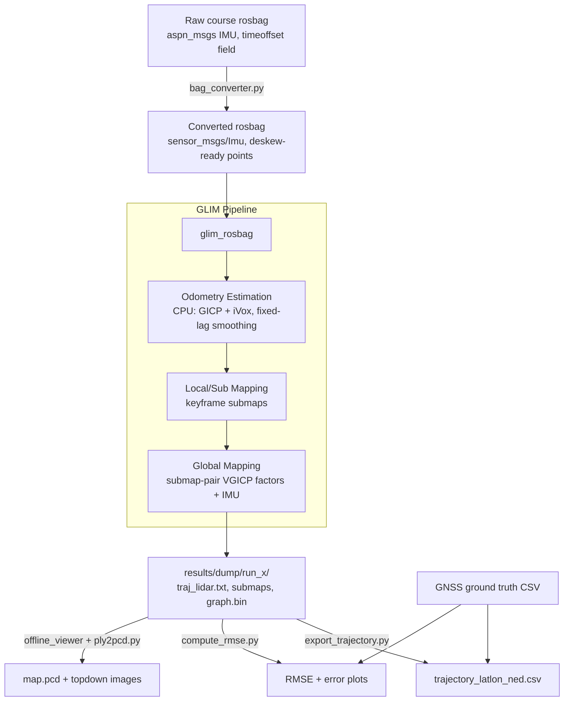
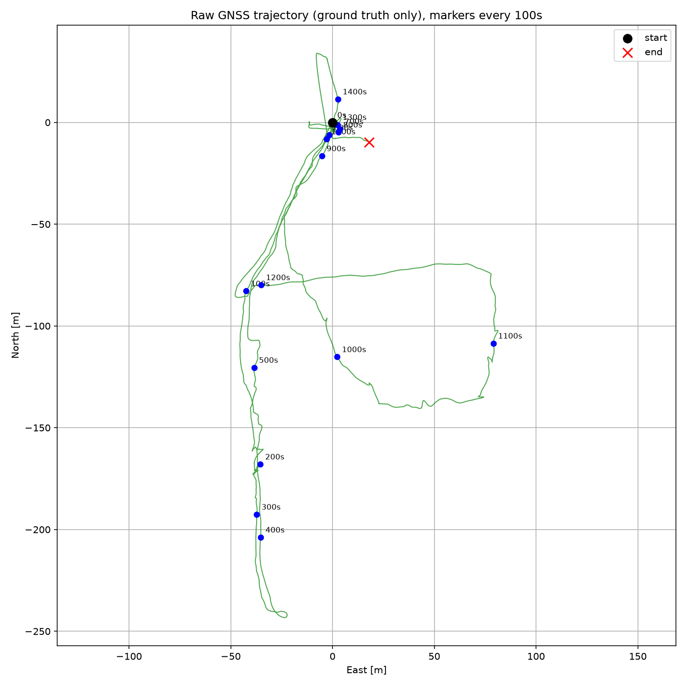

# GLIM (CPU-only) — Ouster OS0-32

CPU-only build of [GLIM](https://github.com/koide3/glim) (LiDAR-Inertial SLAM)
for the Sensor Systems project (Task 3: LIDAR-based Positioning and Mapping). 
No NVIDIA GPU required (pure CPU). Tested on WSL2, Ubuntu 24.04, ROS2 Jazzy.

## Repository structure
```
LIDAR-based-Positioning/
├── config/                          # GLIM config (CPU mode, tuned noise params)
├── data/                             # gitignored -- regenerate locally
│   ├── Test1_data/
│   │   ├── rosbag/                  # original course bag
│   │   └── rosbag_glim/             # OUTPUT of bag_converter.py -- what GLIM reads
│   └── xtrack_gnss_corrected/       # ground truth CSV for evaluation
├── ros2_packages/aspn_msgs/         # reconstructed custom message package
├── scripts/
│   ├── bag_converter.py             # aspn_msgs -> sensor_msgs/Imu, sign fix, timeoffset fix
│   ├── utils.py                     # shared: load traj/GNSS, ENU<->LatLon, SE3 alignment
│   ├── export_trajectory.py         # Deliverable 1: LatLon + NED velocity CSV
│   ├── compute_rmse.py              # Deliverable 3: RMSE/ATE + error plots
│   ├── ply2pcd.py                   # Deliverable 2: PLY -> PCD + topdown map
│   ├── plot_raw_gnss.py             # diagnostic: raw GNSS sanity check
│   └── find_timeoffset.py           # diagnostic: IMU/GNSS clock-sync check
├── results/
│   ├── dump/<run_name>/             # raw GLIM output per run
│   └── deliverables/                # final CSV/PCD/plots for submission
└── README.md
```
`~/src/` (GTSAM, gtsam_points, Iridescence) and `~/ros2_ws/` (glim, glim_ros2)
live outside this repo (see setup below to rebuild). `results/dump/` is used
instead of GLIM's `/tmp/dump` default, since WSL2's `/tmp` is wiped on reboot.

## System architecture



The raw bag can't be fed to GLIM directly: custom IMU message type, inverted
IMU sign convention, non-standard per-point timestamp field. `bag_converter.py`
would fix all three. GLIM's pipeline itself is unmodified upstream GLIM (see
[koide3/glim](https://github.com/koide3/glim), [paper](https://arxiv.org/abs/2407.10344)). 
This repository focuses on the conversion layer, CPU-only build, sensor-specific
config tuning, and the evaluation scripts producing the three required deliverables:
- 2D trajectory (LatLon) and velocity (NED-frame) estimation result (e.g. saved as .csv file);
- Error plot: Estimate vs. Ground Truth (GNSS) using RMSE as metrics;
- 3D point cloud map saved as .pcd.

## Choice of algorithms / system design

- **GLIM** chosen here over LIO-SAM/KISS-ICP to test its fixed-lag smoothing +
  keyframe odometry, which is robust to brief LiDAR degeneracy, and global submap-pair
  registration to avoids pose-graph Gaussian-covariance approximation errors.
- **CPU path** (`libodometry_estimation_cpu.so`, GICP+iVox): CPU only. This is GLIM's 
  fallback path, not its primary design point (see Results discussion).
- **IMU source**: Ouster's own embedded IMU (`/ouster/imu_meas`), not Pixhawk. Since 
  its axes already match the LiDAR frame, `T_lidar_imu` uses GLIM's manufacturer-default Ouster OS0 value
  (`[0.006, -0.012, 0.008, 0,0,0,1]`), tested against identity as a control (see Results).
- **No GNSS/camera fusion.** GLIM has no built-in GNSS factor like LIO-SAM. This would need a
  custom extension module, which is considered as out of scope. GNSS is used only as an
  independent evaluation reference. Camera fusion is natively supported but needs real D435i calibration.
- **Trajectory-to-GNSS alignment**: GLIM's local frame has no absolute heading reference, 
  so an alignment to GNSS local-ENU via SE(3) Umeyama/Horn least-squares (no scaling) is needed 
  before computing error. Similar approach `evo`'s ATE metric uses, which the GLIM paper itself relies on.
- **Noise parameters** (`imu_acc_noise`, `imu_gyro_noise`, `imu_bias_noise`) tuned via manual 
  7-configuration sweep.

---

# Setup

## 1. Install ROS2 Jazzy
```bash
sudo apt update && sudo apt install -y curl gnupg lsb-release
sudo curl -sSL https://raw.githubusercontent.com/ros/rosdistro/master/ros.key -o /usr/share/keyrings/ros-archive-keyring.gpg
echo "deb [arch=$(dpkg --print-architecture) signed-by=/usr/share/keyrings/ros-archive-keyring.gpg] http://packages.ros.org/ros2/ubuntu $(. /etc/os-release && echo $UBUNTU_CODENAME) main" | sudo tee /etc/apt/sources.list.d/ros2.list > /dev/null
sudo apt update
sudo apt install -y ros-jazzy-desktop python3-colcon-common-extensions python3-rosdep
echo "source /opt/ros/jazzy/setup.bash" >> ~/.bashrc && source ~/.bashrc
```
> TLS error on `packages.ros.org`? Use `http://` instead (antivirus HTTPS
> inspection is a common cause; apt's real security is the GPG keyring).
> GUI file dialogs not appearing? `sudo apt install -y zenity`.

## 2. GTSAM 4.3a0 (from source — PPA build is ABI-broken as of July 2026,
see footnote¹)
```bash
sudo apt install -y build-essential cmake git libboost-all-dev libeigen3-dev \
  libomp-dev libmetis-dev libfmt-dev libspdlog-dev libglm-dev libglfw3-dev libpng-dev libjpeg-dev
mkdir -p ~/src && cd ~/src && git clone https://github.com/borglab/gtsam && cd gtsam
git checkout 4.3a0 && mkdir build && cd build
cmake .. -DCMAKE_BUILD_TYPE=Release -DGTSAM_BUILD_EXAMPLES_ALWAYS=OFF -DGTSAM_BUILD_TESTS=OFF \
  -DGTSAM_WITH_TBB=OFF -DGTSAM_USE_SYSTEM_EIGEN=ON -DGTSAM_BUILD_WITH_MARCH_NATIVE=OFF
make -j$(nproc) && sudo make install && sudo ldconfig
```

## 3. gtsam_points (CPU-only)
```bash
cd ~/src && git clone https://github.com/koide3/gtsam_points
mkdir gtsam_points/build && cd gtsam_points/build
cmake .. -DCMAKE_BUILD_TYPE=Release -DBUILD_WITH_CUDA=OFF -DBUILD_WITH_TBB=OFF \
  -DBUILD_WITH_OPENMP=ON -DBUILD_WITH_MARCH_NATIVE=OFF
make -j$(nproc) && sudo make install && sudo ldconfig
```

## 4. Iridescence (viewer)
```bash
cd ~/src && git clone https://github.com/koide3/iridescence --recursive
mkdir iridescence/build && cd iridescence/build
cmake .. -DCMAKE_BUILD_TYPE=Release && make -j$(nproc) && sudo make install && sudo ldconfig
```

## 5. GLIM via colcon
```bash
mkdir -p ~/ros2_ws/src && cd ~/ros2_ws/src
git clone https://github.com/koide3/glim && git clone https://github.com/koide3/glim_ros2
cd ~/ros2_ws
colcon build --cmake-args -DBUILD_WITH_CUDA=OFF -DBUILD_WITH_VIEWER=ON -DBUILD_WITH_MARCH_NATIVE=OFF
echo "source ~/ros2_ws/install/setup.bash" >> ~/.bashrc && source ~/.bashrc
```

## 6. Custom message packages
```bash
cd ~/ros2_ws/src
git clone -b release/1.17 https://github.com/PX4/px4_msgs.git
ln -s ~/LIDAR-based-Positioning/ros2_packages/aspn_msgs ~/ros2_ws/src/aspn_msgs
cd ~/ros2_ws && colcon build --packages-select px4_msgs aspn_msgs && source install/setup.bash
```

¹ *`glim_rosbag` failed with `undefined symbol:
_ZTVN5gtsam28PreintegratedImuMeasurementsE` (reproducible across multiple
version pins, a build inconsistency in the PPA itself, not fixable by
version selection. Source build should avoid it.)*

---

# Pipeline: raw bag → deliverables

### 0. Bag on WSL filesystem
Copy `metadata.yaml` + `rosbag_0.db3` into `data/Test1_data/rosbag/`. Avoid
`/mnt/c/...` and use native WSL filesystem for performance.

### 1. Convert the bag
```bash
cd ~/LIDAR-based-Positioning
python3 scripts/bag_converter.py data/Test1_data/rosbag data/Test1_data/rosbag_glim
```
Fixes (see "Data conversion details" below): custom IMU message type →
`sensor_msgs/Imu`; inverted accelerometer sign + non-standard per-point
timestamp field name/units.

### 2. Run GLIM
```bash
mkdir -p results/dump/test1
ros2 run glim_ros glim_rosbag $(realpath data/Test1_data/rosbag_glim) \
  --ros-args -p config_path:=$(realpath config) \
  -p auto_quit:=true -p dump_path:=$(realpath results/dump/test1)
```
**Always set `auto_quit:=true`**, otherwise `glim_rosbag` finishes reading
the bag and then idles forever waiting for live messages (`rclcpp::spin()`),
which would look like a hang. **Always set `dump_path`** under `results/dump/`.
For faster runs, comment out `libstandard_viewer.so`/`librviz_viewer.so` in
`config/config_ros.json` (GUI rendering competes with GLIM's own CPU).

### 3. Export trajectory — LatLon + NED velocity (Deliverable 1)
```bash
python3 scripts/export_trajectory.py \
  results/dump/test1/traj_lidar.txt \
  data/xtrack_gnss_corrected/xtrack_global_position_t12.csv \
  results/deliverables/trajectory_latlon_ned_test1.csv
```

### 4. RMSE + error plots (Deliverable 3)
```bash
python3 scripts/compute_rmse.py \
  results/dump/test1/traj_lidar.txt \
  data/xtrack_gnss_corrected/xtrack_global_position_t12.csv \
  results/deliverables/test1 "test1"
```
Produces error-vs-time and top-down trajectory comparison plots. Evaluation
is automatically scoped to whatever portion of the bag GLIM actually
processed.

### 5. Point cloud map as PCD (Deliverable 2)
```bash
ros2 run glim_ros offline_viewer $(realpath results/dump/test1)
```
File → Save → Export Points → `results/deliverables/map_test1.ply`, then:
```bash
python3 scripts/ply2pcd.py results/deliverables/map_test1.ply \
  results/deliverables/map_test1.pcd 0.05 results/deliverables/map_test1_topdown.png
```
(`0.05` = 5cm voxel downsampling to minimize the resolution)

## Data conversion details (`bag_converter.py`)

| Fix | Problem | Solution |
|---|---|---|
| IMU message type | `aspn_msgs/MeasurementIMU` (custom, GLIM can't subscribe) | Convert to `sensor_msgs/msg/Imu` |
| Accelerometer sign | At rest read `[0.15, -0.12, **-9.6**]` — GTSAM expects **+9.81** on the up-axis at rest (per GLIM docs) | Negate all 3 axes |
| Per-point timestamps | Field named `timeoffset` (ms), not `t`/`time`/`timestamp` GLIM recognizes → fell back to pseudo-timestamps, degrading deskewing | Rename to `time`, convert ms→s |

`aspn_msgs` has no public ROS2 package, since it's an own implementation of the 
[ASPN 2023 ICD](https://github.com/Open-PNT/ASPN-ICD) spec (YAML, not code) plus a `std_msgs/Header`. 
Here, the `.msg` files are reconstructed directly from the spec (`ros2_packages/aspn_msgs/`).
*(verified correct against real data (decoded gravity magnitude ≈9.6-9.7 m/s², `scripts/verify_aspn_imu.py`.)*

---

# Results / Evaluation

## Parameter sweep (RMSE, full Test1 bag, ~816s processed)

| Run | acc/gyro noise | bias noise | Other | RMSE [m] | Notes |
|---|---|---|---|---|---|
| run1 | 0.05 / 0.02 | 1e-5 (default) | — | 82.9 | Baseline |
| **run2** | **0.01 / 0.005** | **1e-5** | — | **72.3** | **Final config** |
| run3 | 0.05 / 0.02 | 0.01 | — | 92.5 | Worse |
| run4 | 0.1 / 0.05 | 1e-3 | — | 73.8 | |
| run5 | 1e-5 / 1e-5 | 1e-5 | — | 95.3 | Worse (over-confident IMU) |
| run6 | 0.01 / 0.005 | 1e-5 | `T_lidar_imu`=identity | 91.0 | Manufacturer default (run2) better |
| run7 | 0.01 / 0.005 | 1e-5 | deskew off | 67.4 | Lower RMSE, visibly worse map — kept deskew on |




## What are being ruled out

- **Clock desync** - scanned RMSE across ±20s offset (`find_timeoffset.py`): flat curve, no localized minimum.
- **GNSS data quality** — raw track inspected directly (`plot_raw_gnss.py`): largest jump = plausible 0.4 m/s over 15.6s (recording pause), no teleports.
- **Extrinsics** — identity vs. manufacturer default (run2 vs. run7): both poor, default slightly better; millimeters can't explain tens of meters either way.
- **`aspn_msgs`/sign/deskewing bugs** — all fixed and independently verified (gravity magnitude, GLIM's own convention docs, warning-message disappearance).

## Root cause: weak loop closure

1. **Low submap overlap**: Constant low submap overlap throughout every run (`small overlap`
   warnings, typically 0.10–0.25, at or below GLIM's `min_implicit_loop_overlap`
   default of 0.2).
2. **Path length vs. net displacement**: run2 has 414.9m total path with 212.2m
   net displacement (51%). For a loop trajectory it should have been much lower.
3. **Oscillating error over time**: consistent with locally losing/regaining 
   constraint through the route rather than one systemic bias.

GLIM's own internal short-horizon IMU-prediction checks report
centimeter-to-decimeter consistency throughout. Odometry is locally sound,
but outbound-leg drift exceeds what the return leg's point-cloud overlap can
correct via global loop closure.

## Why results may be worse than LIO-SAM / KISS-ICP

Plausible contributing factors based on architectural differences:

- **No GPU**: Here, the CPU path (GICP+iVox) is a lower-fidelity approximation of GLIM's intended 
  VGICP_GPU pipeline, not just a slower version of it.
- **Sparse sensor**: Ouster OS0-32 (32 lines) gives less per scan geometric
  detail than sensors GLIM was primarily benchmarked on, worsening
  degenerate and repetitive geometry scan matching.
- **Consumer-grade embedded IMU**: Possible elevated drift/noise (cheap MEMS, magnetic interference). 
  GLIM's tight coupling assumes a well-behaved IMU, while LIO-SAM's looser coupling or KISS-ICP's 
  IMU-independence may be more robust to this specifically.
- **Loop-closure design**: GLIM's implicit overlap-based closure vs. LIO-SAM's explicit detection 
  (radius search + ICP verify) may trigger more reliably at weaker overlap.
- **Manual, non-exhaustive tuning**: 7 manual tuning of configurations is used rather than 
  for example Allan-variance-based calibration.

## Known limitations

- Pedestrian "ghosting" (trailing point-cloud copies), which is also expected for any
  point-cloud SLAM without dynamic-object filtering. Possibly not a pipeline bug.
- Only Test1 evaluated in depth.
